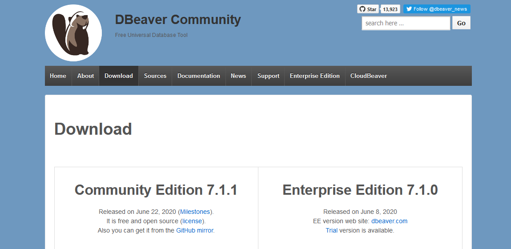
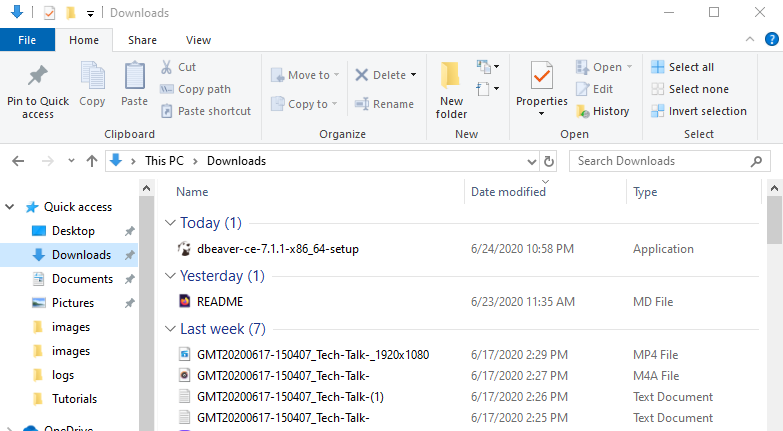
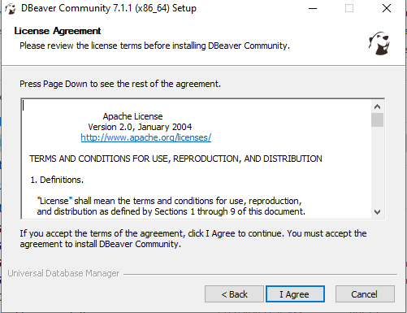
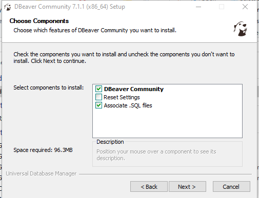

### Step 6: Install DBeaver

## Prerequisite
* Completed PostgreSQL installation

In order to install DBeaver, please visit [DBeaver's official website](https://dbeaver.io/download/).

Once you navigate to the website, you should see the following:

You'll notice that there are two options: Community Edition and Enterprise Edition. Please select the **Community Edition** as it is free. Do NOT select the Enterprise as it is not free.

Note that the newest versions of DBeaver require Java 11, as such, as will be using an older version that can be found in the Archives section. Scroll down to the "Archive" and click on the link. 

Here, you will find links to previous versions with the installers for the Community Edition. Select the "7.1.1" folder and choose the appropriate installer. As with all other software listed here, please make sure that you choose the correct installer for your system. For windows users, you want to select the "dbeaver-ce-7.1.1-x86_64-setup.exe".

Once you've clicked on the installer that is compatible with your system, you'll be prompted to save the file. Save it and note where you've saved it on your machine. These files are usually stored in your computer's "Downloads" folder by default.

Now navigate to the folder where the installer is stored. For this example, we've downloaded the file to the "Downloads" folder.

Double click the installer. Once you've done so, the installer will be launched. The installer should take you through the process of setting up DBeaver. You'll be asked, for instance, to select a language of choice and review license terms before you install the software.

When you arrive at the portion of the setup which is titled "Choose Components", please select "DBeaver Community" and "Associate .SQL files".

If your installation was successful, you should now be able to search for and find "DBeaver" using your computer's search bar.