# [Week 2] - Install Apache Maven

## Prerequisite
* Completed Java Installation
* Completed Spring Tool Suite Installation

1. Navigate in your web browser to the [Maven Download Page](https://maven.apache.org/download.cgi) and scroll down to the "Files" section. Click the Binary zip archive link to download. Approve any firewall/security popups asking if you are sure you want to download the file. 

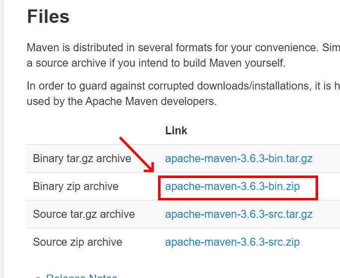

2. The download should appear in your browser. When it completes right-click and click "Show in folder." Skip to step 4. If you were unable to right-click and show in folder proceed to step 3. 

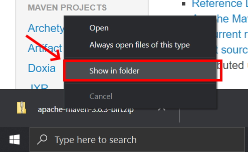

3. If you could not open the file location from your browser, open your file explorer, click downloads, and search "maven" in the upper right search bar. You should see the file you just downloaded. 

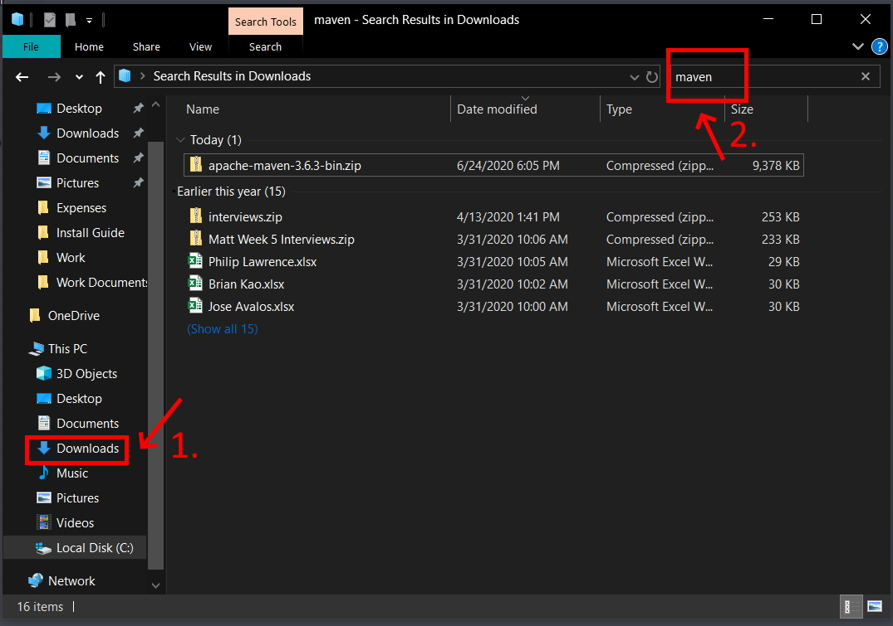

4. Right click the Maven zip archive you just downloaded and click "Extract All..."

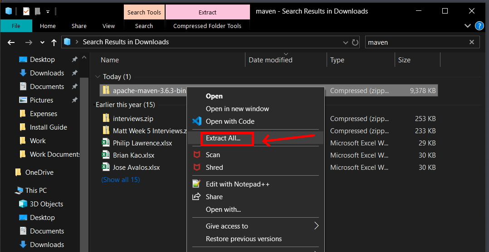

5. Your extraction wizard will open. Set the file path to "C:\Maven" and click the box to show extracted files when complete. Then click "Extract."

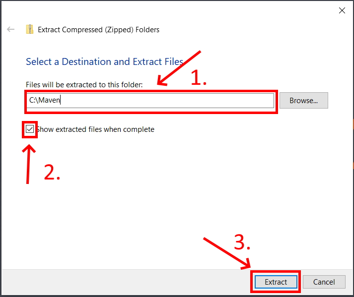

6. Your file will be unzipped and your file explore will open a window to C:\Maven containing the folder with your maven version. Double click to open that folder. 

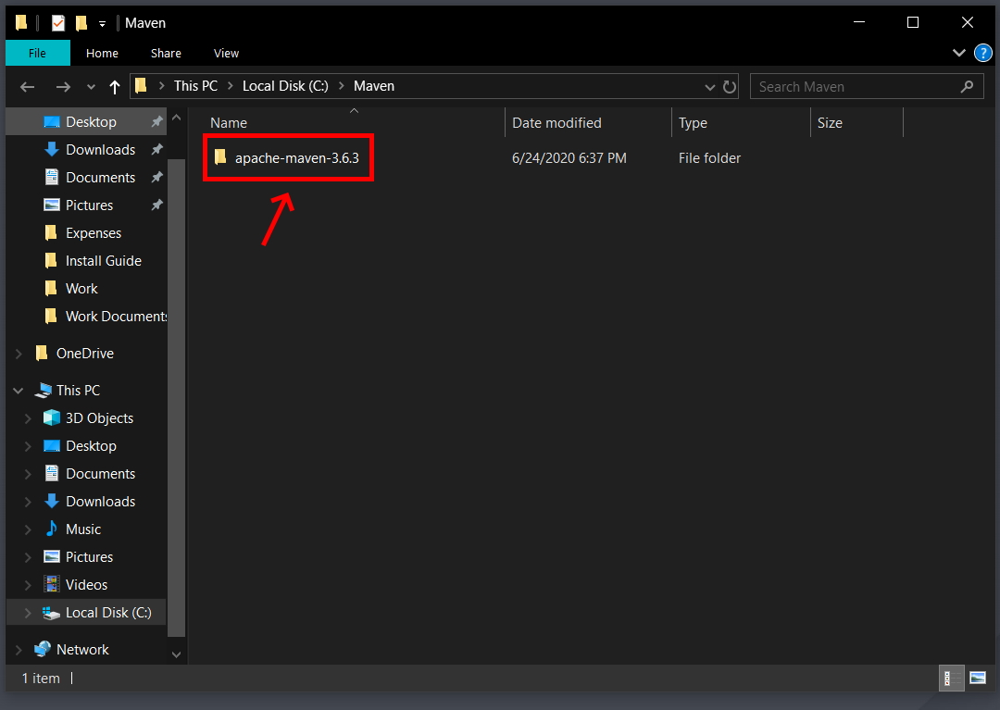

7. Now inside the versions specific folder, click the navigation bar and the top and copy the file path. You will need this for your environment variables. 

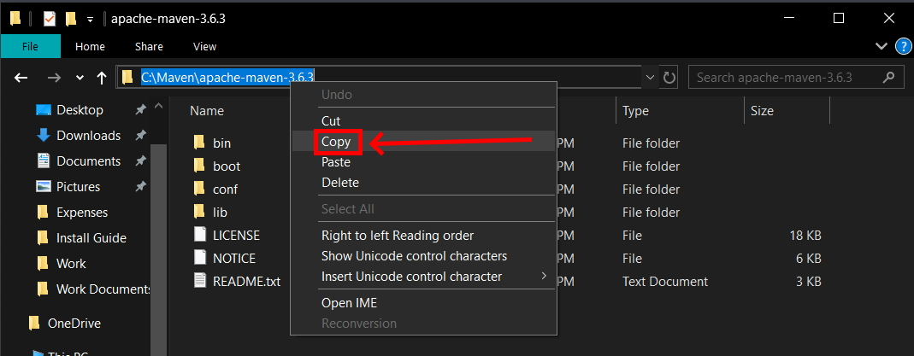

8. Use your system search tool (next to the windows button) to look for "Edit the system environment variables" in the control panel. Be sure that you open the SYSTEM environment not the ones just for your account. 

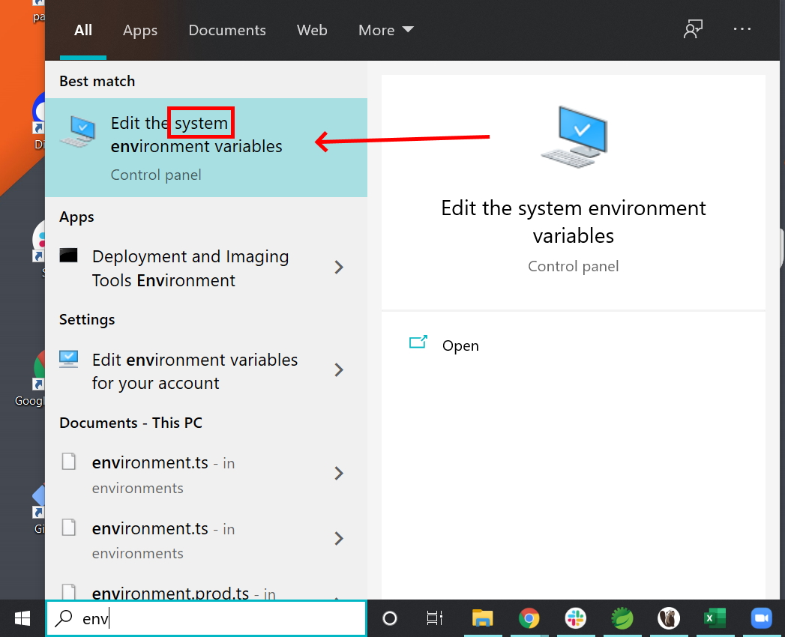

9. Click the "Environment Variables" button in the window that opens.

10. Under "System Variables" click the "New" button. 

11. Name the new variable "M2_HOME" and give it the value of the file path you copied in step 7. Then click "OK."

12. Click the new button again. Give the variable the name "M2" and the file path "%M2_HOME%\bin" then click "OK."

13. In your system variables then select the "Path" variable and click "Edit."

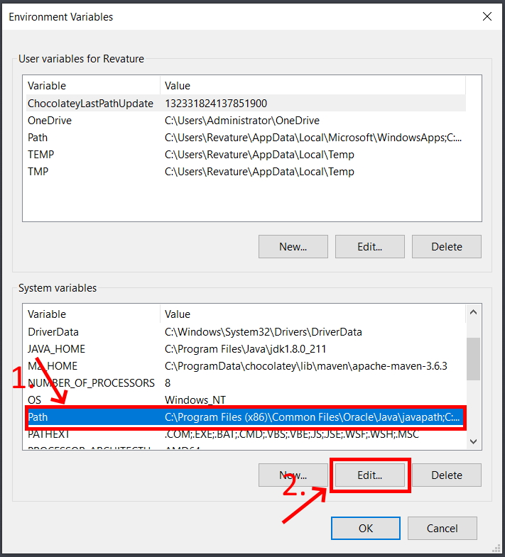

14. Click new to open a new line and type in "%M2%" then click "OK."

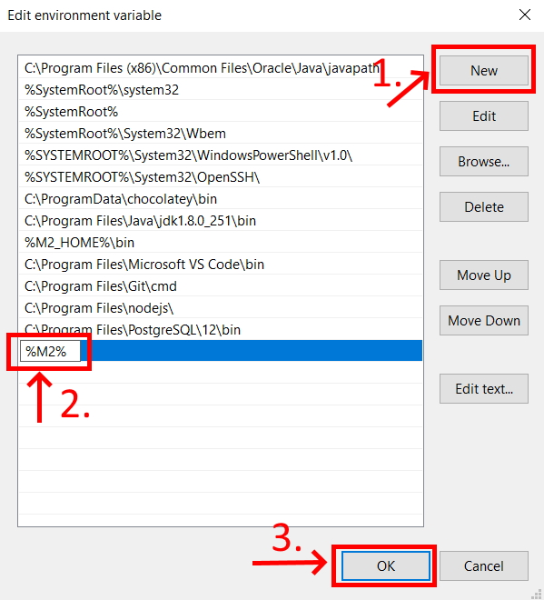

15. Click "OK" to close the Environment Variables window. 

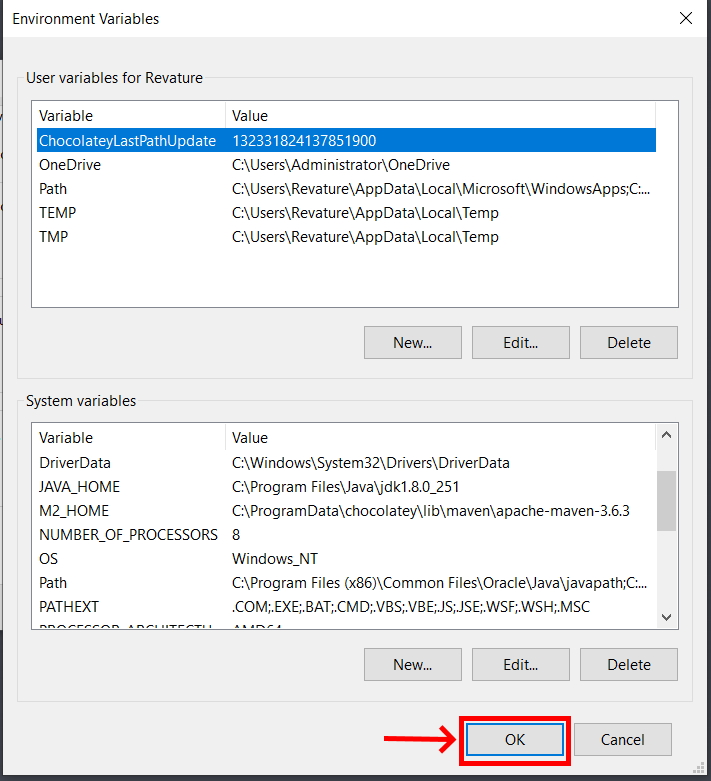

16. Open Git Bash and type "mvn -v" then hit Enter. If that returns the maven version you have it set up correctly. 

