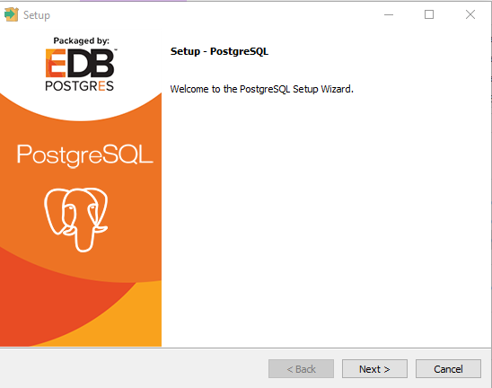
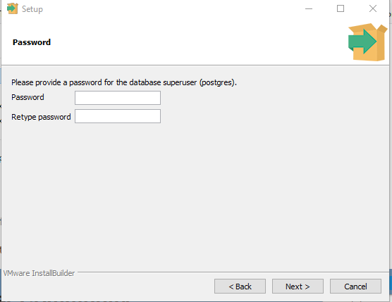

# [Week 2] - Install PostgreSQL 10

In order to install PostgreSQL, please visit [PostgreSQL's official website](https://www.enterprisedb.com/downloads/postgres-postgresql-downloads).

Once you've navigated to the website, you should see the following:

Please look at the row for **version 10.13** as we will downloading this version. Select the download link which corresponds with your system and click it.

You'll then be prompted to save the file. Click "Save File".

The file should now be located in your "Downloads" folder.

Double click the file, which should launch the installer. You might be asked if you want the application to make changes to your device. Say "yes".

You'll be presented with several menus in the Setup Wizard.

Hit "Next" until you get to the "Select Components" menu. Here, you'll want to select and/or deselect the following and then click "Next":

Continue to hit "Next" until you reach the "Password" menu. Here you will be tasked with providing a password for the default Postgres user (which is "postgres"). The password is completely up to you. That said, DO NOT forget your password as you won't be able to login to your database as the superuser. If you have to, write your password down somewhere or use a password manager.

After you've decided on a password, hit "Next" on the remaining menus and allow time for Postgres to be installed. Once the installation is complete, you might be asked if you want to launch Stack Builder. You can say "no".

PostgreSQL should now be successfully installed on your computer.